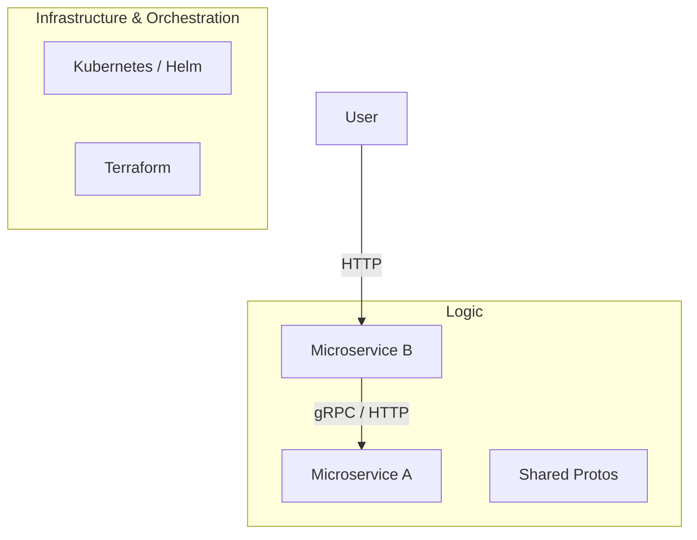

# 🤖 DevOps Agentic AI Journey

Welcome to this "didactic" repository. This project is not just a microservices architecture; it is a testament to the collaboration between a user and an **Agentic AI (Antigravity)** to build, automate, and structure a complete DevOps ecosystem.

## 🌟 The "Agentic AI" Experience

This repository has been entirely driven by an AI. Here are the major stages of its transformation:

### 1. 🔍 Discovery & Analysis
The AI began by exploring raw and disparate files. It identified two embryonic Node.js microservices and fragments of Kubernetes configuration.

### 2. 🔗 gRPC Integration (Inter-Service Communication)
Instead of simple HTTP calls, the AI proposed and implemented robust **gRPC** communication:
- Creation of `shared/protos/service.proto`.
- Implementation of the gRPC server in `ms-a`.
- Implementation of the gRPC client with data aggregation in `ms-b`.

### 3. ⚙️ Lifecycle Automation
The AI laid the foundations for operational excellence:
- **CI/CD**: Implementation of GitHub Actions for automated build and test.
- **Docker**: Optimization of Dockerfiles with `HEALTHCHECK` instructions.
- **Scripts**: Creation of PowerShell scripts (`scripts/`) for local build, testing, and promotion to the Stage environment.

### 4. 🏗️ "Best Practices" Refactoring
The AI suggested and executed a major structural reorganization to move from a cluttered root to a professional structure:
- Grouping apps in `apps/`.
- Centralizing IaC in `infrastructure/`.
- Clean management of Kubernetes in `k8s/` (separation of charts and environments).

## 🚀 Global Architecture

## 🛠️ Automation Tools

| Script | Role |
| :--- | :--- |
| `scripts/build-and-test.ps1` | Docker build and local unit tests. |
| `scripts/promote-to-stage.ps1` | Promotes a validated version from Dev to Stage. |
| `scripts/create-pr.ps1` | Automates Pull Request creation via the GitHub API. |

---

## 👨‍🏫 How to use this repo?
This project is designed to show how an AI can not only write code but also **manage the structure, infrastructure, and governance** of a complex project. 

Feel free to explore the `.gemini/antigravity/brain/` folder (if available) to see the execution plans and the AI's thought process during this project.
