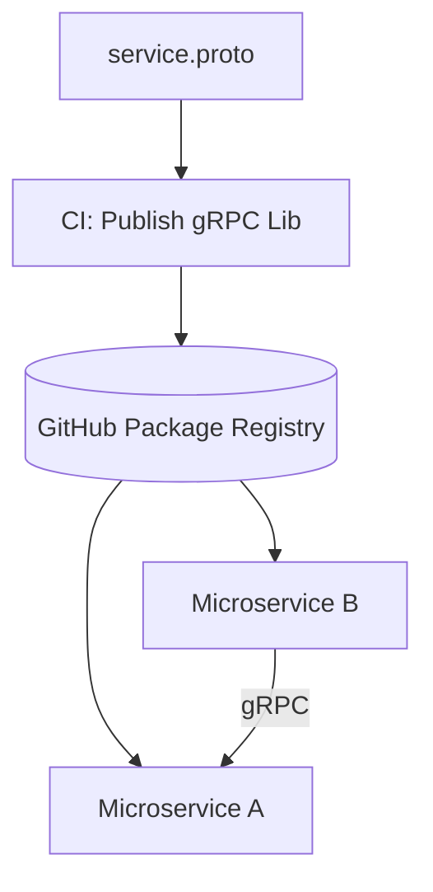

# 🤖 DevOps Agentic AI Journey

Welcome to this "didactic" repository. This project is a complete DevOps ecosystem built through the collaboration between a user and an **Agentic AI (Antigravity)**.

## 🏗️ Industrial Architecture (Level 3)

This project has evolved from a simple microservices demo to a professional-grade architecture:

### 1. Contract-First gRPC
We use an industrial "Level 3" approach to service communication:
- **Centralized Registry**: gRPC definitions live in `@cdesplanches-orka/grpc-lib` (`shared/grpc-lib`).
- **Automated Distribution**: Protos are built and published to **GitHub Packages** via CI/CD.
- **Decoupled Services**: Microservices consume the contract as a standard NPM versioned dependency.



### 2. Poly-repo Management
The microservices are managed as independent repositories linked via **Git Submodules**:
- `apps/ms-a` -> [microservice-a](https://github.com/cdesplanches-orka/microservice-a)
- `apps/ms-b` -> [microservice-b](https://github.com/cdesplanches-orka/microservice-b)

---

## 🚀 Key Features

- **Automated CI/CD**: Full pipelines for testing, building, and pushing Docker images to GHCR.
- **Infrastructure as Code**: Kubernetes manifests and Helm charts located in `k8s/`.
- **DevOps Scripts**: PowerShell tools for environment promotion and PR automation.

---

## 🛠️ Getting Started

### Cloning the repository
Since this project uses Git Submodules, use the `--recursive` flag:
```bash
git clone --recursive https://github.com/cdesplanches-orka/devops-agentic-ai.git
```

### Repository Structure
- `apps/`: The microservices (Submodules).
- `shared/grpc-lib/`: The central gRPC contract library.
- `k8s/`: Kubernetes orchestration (Charts & Environments).
- `scripts/`: Automation and governance utilities.

---

## 👨‍🏫 AI Journey
Feel free to explore the `.gemini/antigravity/brain/` folder to see the execution plans, walkthroughs, and the AI's step-by-step reasoning.
