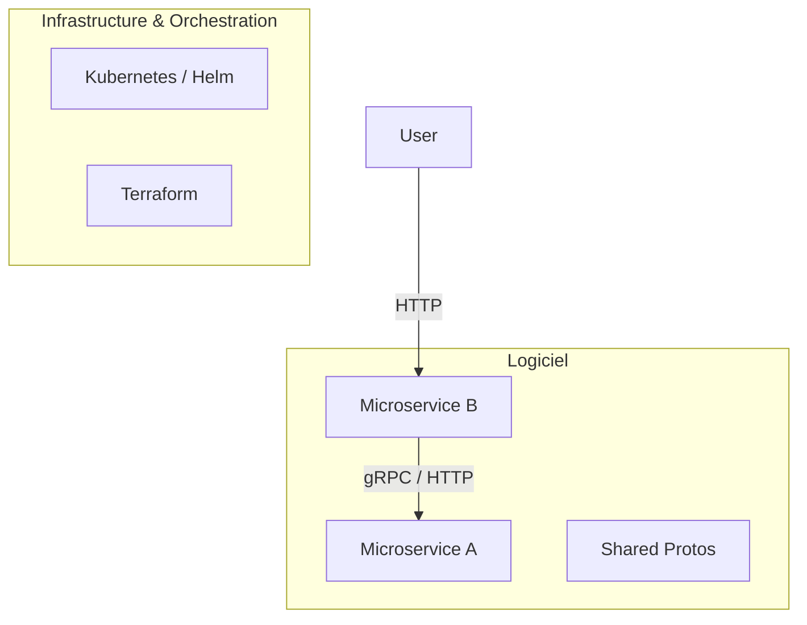

# 🤖 DevOps Agentic AI Journey

Bienvenue dans ce dépôt "didactique". Ce projet n'est pas seulement une architecture de microservices ; c'est le témoignage d'une collaboration entre un utilisateur et une **IA Agente (Antigravity)** pour construire, automatiser et structurer un écosystème DevOps complet.

## 🌟 L'Expérience "Agentic AI"

Ce dépôt a été entièrement piloté par une IA. Voici les grandes étapes de sa transformation :

### 1. 🔍 Découverte & Analyse
L'IA a débuté par une exploration de fichiers bruts et disparates. Elle a identifié deux microservices Node.js embryonnaires et des fragments de configuration Kubernetes.

### 2. 🔗 Intégration gRPC (Communication Inter-Services)
Plutôt que de simples appels HTTP, l'IA a proposé et implémenté une communication **gRPC** robuste :
- Création de `shared/protos/service.proto`.
- Implémentation du serveur gRPC dans `ms-a`.
- Implémentation du client gRPC avec agrégation de données dans `ms-b`.

### 3. ⚙️ Automatisation du Cycle de Vie
L'IA a mis en place les fondations de l'excellence opérationnelle :
- **CI/CD** : Mise en place de GitHub Actions pour le build et le test automatique.
- **Docker** : Optimisation des Dockerfiles avec des `HEALTHCHECK`.
- **Scripts** : Création de scripts PowerShell (`scripts/`) pour le build local, le test, et la promotion vers l'environnement Stage.

### 4. 🏗️ Refactorisation "Best Practices"
L'IA a suggéré et exécuté une réorganisation structurelle majeure pour passer d'une racine encombrée à une structure professionnelle :
- Regroupement des apps dans `apps/`.
- Centralisation de l'IaC dans `infrastructure/`.
- Gestion propre de Kubernetes dans `k8s/` (séparation des charts et des environnements).

## 🚀 Architecture Globale

## 🛠️ Outils d'Automatisation

| Script | Rôle |
| :--- | :--- |
| `scripts/build-and-test.ps1` | Build Docker et tests unitaires locaux. |
| `scripts/promote-to-stage.ps1` | Pousse une version validée du Dev vers le Stage. |
| `scripts/create-pr.ps1` | Automatise la création de Pull Requests via l'API GitHub. |

---

## 👨‍🏫 Comment utiliser ce repo ?
Ce projet est conçu pour montrer comment une IA peut non seulement écrire du code, mais aussi **gérer la structure, l'infrastructure et la gouvernance** d'un projet complexe. 

N'hésitez pas à explorer le dossier `.gemini/antigravity/brain/` (si disponible) pour voir les plans d'exécution et le cheminement de pensée de l'IA durant ce projet.
