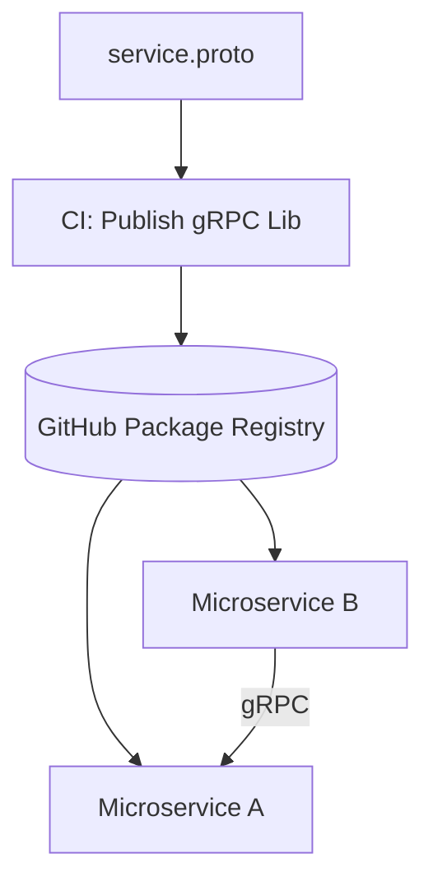

# 🤖 DevOps Agentic AI Journey

Welcome to this "didactic" repository. This project is a complete DevOps ecosystem built through the collaboration between a user and an **Agentic AI (Antigravity)**.

## 🏗️ Industrial Architecture (Level 3)

This project has evolved from a simple microservices demo to a professional-grade architecture:

### 1. Contract-First gRPC
We use an industrial "Level 3" approach to service communication:
- **Centralized Registry**: gRPC definitions live in `@cdesplanches-orka/grpc-lib` (`shared/grpc-lib`).
- **Automated Distribution**: Protos are built and published to **GitHub Packages** via CI/CD.
- **Decoupled Services**: Microservices consume the contract as a standard NPM versioned dependency.


```mermaid
graph TD
    Proto[service.proto] --> CI_P[CI: Publish gRPC Lib]
    CI_P --> Registry[(GitHub Package Registry)]
    Registry --> MSA[Microservice A]
    Registry --> MSB[Microservice B]
    MSB -- gRPC --> MSA
```

### 2. Poly-repo Management
The microservices are managed as independent repositories linked via **Git Submodules**:
- `apps/ms-a` -> [microservice-a](https://github.com/cdesplanches-orka/microservice-a)
- `apps/ms-b` -> [microservice-b](https://github.com/cdesplanches-orka/microservice-b)

---

## 🚀 Key Features

- **Automated CI/CD**: Full pipelines for testing, building, and pushing Docker images to GHCR (GitHub Actions v4).
- **Infrastructure as Code**: Kubernetes manifests and Helm charts in `k8s/` with resource limits and probes.
- **DevOps Scripts**: PowerShell tools for environment promotion and PR automation.

---

## 🛠️ Getting Started

### Cloning the repository
Since this project uses Git Submodules, use the `--recursive` flag:
```bash
git clone --recursive https://github.com/cdesplanches-orka/devops-agentic-ai.git
```

### Repository Structure
| Path | Description |
|------|-------------|
| `apps/` | Microservices (Git submodules) |
| `shared/grpc-lib/` | Central gRPC contract library |
| `k8s/charts/` | Helm charts (ms-a, ms-b, grafana-values) — **ArgoCD sync source** |
| `k8s/envs/` | Standalone manifests for direct apply |
| `k8s/argocd/` | ArgoCD Application definitions |
| `scripts/` | PowerShell automation utilities |
| `docs/` | Operations guide |

### Kubernetes deployment
Before deploying, create the GHCR image pull secret. See [docs/OPERATIONS.md](docs/OPERATIONS.md) for details.

---

## 📜 Scripts

| Script | Purpose |
|--------|---------|
| `scripts/build-and-test.ps1` | Build and test both microservices (run from repo root or `scripts/`) |
| `scripts/promote-to-stage.ps1` | Promote image tag to Stage |
| `scripts/deploy-prod.ps1` | Blue-Green or Canary deployment (mock) |
| `scripts/create-pr.ps1` | Create PR via GitHub API (requires `GITHUB_TOKEN`) |
| `scripts/verify-live.ps1` | Verify stack with Docker Compose |

---

## 📖 Documentation

- **[docs/OPERATIONS.md](docs/OPERATIONS.md)** — GHCR secret setup, scripts usage, Kubernetes structure, Grafana deployment.

---

## 👨‍🏫 AI Journey
Feel free to explore the `.gemini/antigravity/brain/` folder to see the execution plans, walkthroughs, and the AI's step-by-step reasoning.
